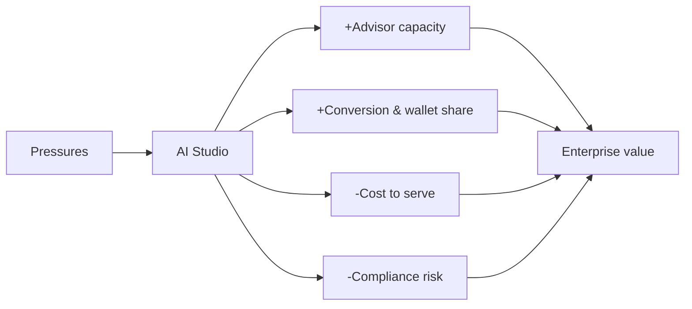

# Deliverable 0 — Executive Summary

## The opportunity

Wealth & Asset Management (WAM) firms are caught between **fee compression** and **rising cost-to-serve**. Advisors spend 60-70% of their week on non-advisory work (meeting prep, note-taking, CRM hygiene, compliance paperwork, portfolio admin), while clients increasingly expect Amazon-grade personalization and Netflix-grade responsiveness. The economics no longer work without a structural productivity step-change.

**Salesforce Wealth AI Studio** is an FSC-native accelerator that applies AI Copilots, autonomous Agents, agentic workflows, predictive analytics, and generative AI across the full WAM client and operations lifecycle to **return 10-15 hours per advisor per week** and materially lift acquisition, retention, and wallet share.

## Strategic thesis

The studio is built on three design principles:

1. **FSC-native first.** Use standard Financial Services Cloud objects (Account, Household, Financial Account, Financial Goal, Interaction Summary, etc.) before any custom object, so the accelerator is portable across orgs and managed-package friendly.
2. **Agentforce as the productivity layer.** Seven role-aligned agents (Advisor, Portfolio, Service, Distribution, Compliance, Operations, Executive) wrap Einstein, Prompt Builder, and Data Cloud-grounded knowledge into role-aware copilots and autonomous workflows.
3. **Governance by construction.** Consent, data security, audit, model governance, prompt governance, and Responsible AI are first-class layers, not afterthoughts, which is essential for a regulated industry.

## What's inside

| Layer | Capability | Salesforce technology |
|---|---|---|
| Experience | 5 role workspaces (desktop + mobile) | Lightning, Experience Cloud, Mobile |
| AI Experience | Copilot framework, command center, recommendation center | Agentforce, Einstein |
| Platform | Sales/Service/Marketing/FSC, analytics | FSC, CRM Analytics |
| Agentforce | 7 role agents + agentic workflows | Agent Builder, Prompt Builder |
| Intelligence | Predictions, recommendations, grounding | Einstein AI, Data Cloud RAG |
| Data | Unified profile + market/custodian/research | Data Cloud, FSC data model |
| Governance | Consent, audit, model & prompt governance | Shield, Data Cloud, Trust Layer |

## Use case portfolio (40 prioritized)

- **Tier 1 (MVP, 23 use cases):** Advisor Briefing, Meeting Prep Copilot, Next Best Action, Portfolio Health Analyzer, Client 360 Intelligence, Lead Scoring, KYC Copilot, Onboarding Assistant, Executive dashboards, and more.
- **Tier 2 (Scale, 9 use cases):** Proposal Copilot, Cross-Sell Intelligence, Predictive Attrition, Compliance Surveillance, Reconciliation Assistant, and more.
- **Tier 3 (Agentic Future, 8 use cases):** Autonomous Advisor/Service/Operations/Compliance/Prospecting agents, AI Branch Manager, Autonomous Portfolio Monitoring, Hyper-Personalized Engagement.

Each use case is scored on a weighted model: Strategic Value (30%), Operational Value (25%), AI Readiness (15%), Salesforce Fit (15%), Demo Impact (15%). See [D2](02-ai-use-case-catalog.md).

## Headline value (illustrative, see D13 for the full model)

| Persona | Primary lever | Hours saved / week | Value driver |
|---|---|---|---|
| Wealth Advisor | Meeting prep + notes + NBA | 8-12 | Wallet share, retention |
| Portfolio Manager | Commentary + risk detection | 6-9 | Performance, scale |
| Client Service Associate | Service resolution copilot | 7-10 | Lower handle time |
| Distribution Specialist | Lead scoring + research | 5-8 | Conversion rate |
| Compliance Officer | KYC/AML + surveillance | 6-10 | Risk reduction, audit |
| Operations Analyst | Doc extraction + reconciliation | 8-12 | Exception reduction |

Firm-level: a 200-advisor firm recovering ~10 hours/advisor/week unlocks the equivalent of **~50+ FTEs of capacity** redeployed to revenue-generating advice, plus measurable AUM growth and compliance-risk reduction.

## Delivery approach

A 4-phase roadmap (D11): **Foundation → Intelligence → Agentic Automation → Autonomous Wealth Enterprise**, packaged (D12) for one-click-ish deployment into any FSC-enabled org via managed/unlocked packages, agent/prompt/flow templates, dashboard templates, and industry playbooks.

## How to navigate this accelerator

Start with the [Challenge Matrix (D1)](01-industry-challenge-matrix.md) to ground the problem, then the [Use Case Catalog (D2)](02-ai-use-case-catalog.md) for prioritization, the [Architecture (D4)](04-enterprise-architecture.md) and [Data Model (D5)](05-fsc-data-model.md) for the build, and the [Demo Storyline (D10)](10-demo-storyline.md) + [ROI Framework (D13)](13-roi-value-framework.md) for the executive conversation.
