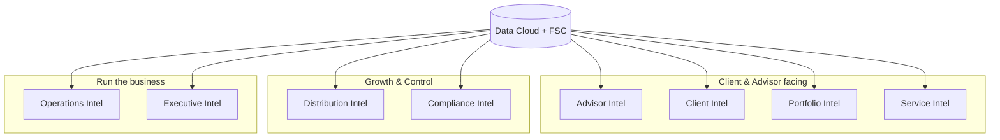

# Deliverable 3 — Capability Model

The studio's capabilities are organized into **8 intelligence domains**. Each capability lists Inputs, Outputs, Users, Dependencies, and Salesforce Components, and links back to the use cases (UC#) it realizes.

*Diagram: [capability mindmap](../diagrams/03-capability-mindmap.mmd).*

## 1. Advisor Intelligence
*Makes advisors more productive and relationships deeper.* Realizes UC 1-5, 7, 24.

| Capability | Inputs | Outputs | Users | Dependencies | Salesforce Components |
|---|---|---|---|---|---|
| Advisor Briefing | Calendar, book, events, tasks | Prioritized daily briefing | Advisor | Data Cloud profile, FSC activity | Advisor Agent, Prompt Builder, Home/App page |
| Meeting Prep | Profile, goals, holdings, history | Briefing + agenda | Advisor | Unified profile, interaction history | Advisor Agent, Prompt template, Document gen |
| Follow-up Generation | Meeting notes, action items | Draft emails + tasks | Advisor | Interaction Summary | Advisor Agent action, Flow |
| Relationship Intelligence | Interactions, relationships, sentiment | Relationship signals + context | Advisor | Data Cloud signals, FSC Relationship | Advisor Agent, Einstein, Lightning cards |
| Next Best Action | Profile, goals, propensity | Ranked recommended actions | Advisor | Calculated insights, propensity | Einstein NBA, Action Plan, Advisor Agent |
| Proposal Generation | Plan, models, fees | Draft proposal doc | Advisor | Product/model data | Advisor Agent, Prompt Builder, Doc gen |

## 2. Client Intelligence
*Unifies and scores the client relationship.* Realizes UC 10-12, 26, 29, 40.

| Capability | Inputs | Outputs | Users | Dependencies | Salesforce Components |
|---|---|---|---|---|---|
| Client 360 | All client data | Summarized 360 + Q&A | Advisor, CSA | Data Cloud unification (core) | Advisor Agent, Lightning Client 360, RAG |
| Engagement Scoring | Multi-channel activity | Engagement score | CSA, Advisor | Engagement events, CI | Data Cloud CI, Engagement Score object |
| Client Health Score | Engagement, perf, service | Health score + drivers | Advisor | Composite calculated insights | Data Cloud CI, Client Health Score object |
| Cross-Sell Intelligence | Holdings, gaps, life events | Cross-sell NBAs | Advisor | Propensity/affinity models | Einstein recommendations, Advisor Agent |
| Predictive Attrition | Engagement, perf, issues | Churn risk + retention play | Advisor | Churn features (CI) | Einstein prediction, Advisor Agent |
| Hyper-Personalization | Profile, preferences, signals | Personalized content/channel | Client (advisor-supervised) | Real-time profile, segmentation | Data Cloud, Prompt Builder, orchestration |

## 3. Portfolio Intelligence
*Monitors, explains, and optimizes portfolios.* Realizes UC 6-9, 27, 39.

| Capability | Inputs | Outputs | Users | Dependencies | Salesforce Components |
|---|---|---|---|---|---|
| Portfolio Health | Holdings, benchmarks, risk | Health score + alerts | PM, Advisor | Portfolio/market streams | Portfolio Agent, Portfolio Alert object |
| Review Prep | Holdings, perf, goals | Review pack | Advisor | Performance data | Portfolio Agent, Prompt Builder |
| Commentary Generation | Performance, attribution | Client-ready commentary | PM | Performance + market data | Portfolio Agent, Prompt template, guardrails |
| Risk Exposure Detection | Holdings, limits, market | Risk signals | PM | Market data, exposure CI | Portfolio Agent, Risk Signal object |
| Scenario Analysis | Holdings, assumptions | Scenario outcomes | PM | Market data + analytics | Portfolio Agent, calc actions |
| Autonomous Monitoring | Real-time holdings/market | Continuous alerts | PM (supervisory) | Streaming data | Portfolio Agent (autonomous), alerts |

## 4. Service Intelligence
*Speeds and improves client servicing.* Realizes UC 28, 34.

| Capability | Inputs | Outputs | Users | Dependencies | Salesforce Components |
|---|---|---|---|---|---|
| Service Resolution | Case, knowledge, history | Draft resolution + steps | CSA | Knowledge base, interactions | Service Agent, Knowledge grounding |
| Autonomous Service | Case, entitlements, knowledge | Resolved/escalated case | CSA (supervisory), Client | Knowledge + interaction data | Agentforce Service Agent, guardrails |
| Case Triage & Routing | Case attributes, skills | Prioritized + routed cases | CSA, Manager | Case data | Service Agent, Omni-Channel, Flow |

## 5. Distribution Intelligence
*Generates and converts pipeline.* Realizes UC 13-15, 25, 37.

| Capability | Inputs | Outputs | Users | Dependencies | Salesforce Components |
|---|---|---|---|---|---|
| Lead Scoring | Source, firmographics, behavior | Lead score | Distribution Spec. | Behavioral + enrichment | Einstein Lead Scoring |
| Lead Prioritization | Score, value, fit, recency | Ranked work queue | Distribution Spec. | Propensity + value signals | Distribution Agent, list views |
| Prospect Research | Public/CRM/enrichment data | Research brief | Distribution Spec. | Research sources, enrichment | Distribution Agent, RAG |
| Referral Intelligence | Relationship graph, history | Referral predictions + nudges | Distribution Spec., Advisor | Relationship graph | Referral Prediction object, Agent |
| Autonomous Prospecting | Market + behavioral data | Research + outreach (approved) | Distribution Spec. (supervisory) | Enrichment + behavior | Distribution Agent (autonomous) |

## 6. Compliance Intelligence
*Reduces risk and improves audit readiness.* Realizes UC 16-18, 30, 36.

| Capability | Inputs | Outputs | Users | Dependencies | Salesforce Components |
|---|---|---|---|---|---|
| KYC | Identity docs, client data, lists | Verified KYC pack + findings | Compliance Officer | Document insights, risk data | Compliance Agent, Compliance Finding |
| AML Screening | Transactions, watchlists | Triaged alerts + rationale | Compliance Officer | Transaction + screening data | Compliance Agent, Case |
| Regulatory Monitoring | Reg feeds, policies | Impact summaries + tasks | Compliance Officer | External feeds, knowledge | Compliance Agent, Knowledge grounding |
| Surveillance | Comms, trades, policies | Anomaly findings | Compliance Officer | Comms/trade ingestion | Compliance Agent, Compliance Finding |
| Autonomous Compliance | All compliance data | Continuous findings + evidence | Compliance Officer (supervisory) | Comms/trade/reg data | Compliance Agent (autonomous), audit logs |

## 7. Operations Intelligence
*Automates back-office work and exceptions.* Realizes UC 19-21, 31, 32, 35.

| Capability | Inputs | Outputs | Users | Dependencies | Salesforce Components |
|---|---|---|---|---|---|
| Onboarding Orchestration | Client data, docs, checklist | Activated accounts + status | Ops Analyst | Document insights, profile | Operations Agent, Flow, Action Plan |
| Document Extraction | PDFs, IDs, statements | Structured records | Ops Analyst | Unstructured ingestion | Operations Agent, Document AI |
| Workflow Automation | Process defs, case data | Executed workflows | Ops Analyst | Operational data | Operations Agent, Flow, Automation Template |
| Reconciliation | Internal + custodian records | Matched + explained breaks | Ops Analyst | Multi-source data | Operations Agent, matching actions |
| Cash Movement Intelligence | Transactions, limits | Anomaly flags | Ops Analyst | Transaction streams | Operations Agent, Risk Signal |
| Autonomous Operations | Process states, docs | Straight-through processing | Ops Analyst (supervisory) | Operational data | Operations Agent (autonomous) |

## 8. Executive Intelligence
*Gives leaders real-time visibility and coaching.* Realizes UC 22, 23, 38.

| Capability | Inputs | Outputs | Users | Dependencies | Salesforce Components |
|---|---|---|---|---|---|
| Advisor Productivity | Activities, AI usage, outcomes | Productivity dashboard + narrative | Branch Manager | Activity + usage analytics | CRM Analytics, Executive Agent |
| Revenue Intelligence | AUM, fees, pipeline, attrition | Revenue dashboard + forecast | Branch Manager | Revenue/AUM data | CRM Analytics, Einstein Discovery |
| AI Branch Manager | Team perf + outcomes | Coaching insights + alerts | Branch Manager | Team analytics | Executive Agent, Einstein insights |
| Decision Intelligence | Cross-domain insights | Recommended decisions | Executives | All calculated insights | Executive Agent, analytics |

## Capability-to-domain coverage

| Domain | Capabilities | Tier-1 use cases |
|---|---|---|
| Advisor Intelligence | 6 | 6 |
| Client Intelligence | 6 | 3 |
| Portfolio Intelligence | 6 | 4 |
| Service Intelligence | 3 | 0 (Tier 2/3) |
| Distribution Intelligence | 5 | 3 |
| Compliance Intelligence | 5 | 3 |
| Operations Intelligence | 6 | 3 |
| Executive Intelligence | 4 | 2 |

These capabilities are delivered through the layered architecture in [D4](04-enterprise-architecture.md), grounded on the data model in [D5](05-fsc-data-model.md), and operated by the agents in [D6](06-agentforce-design.md).
