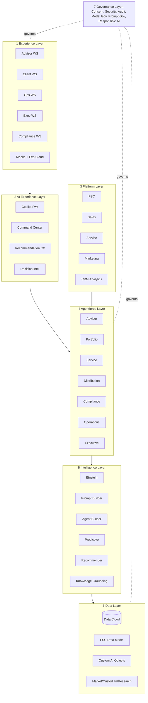
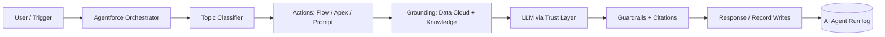
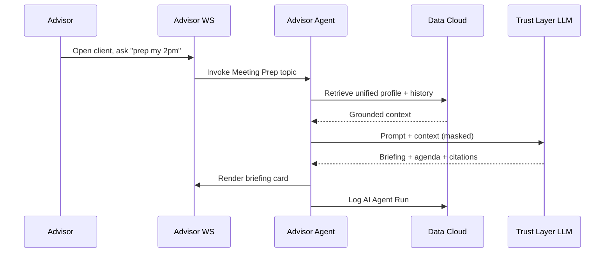

# Deliverable 4 — Enterprise Architecture

A 7-layer reference architecture for the Salesforce Wealth AI Studio. Each layer is FSC-native and Agentforce/Data Cloud-enabled, with a cross-cutting Governance layer.

## Layered overview

## Layer detail

### 1. Experience Layer
Role-based workspaces delivered on Lightning (desktop), Salesforce Mobile, and Experience Cloud (client + partner portals).

| Component | Purpose | Salesforce technology |
|---|---|---|
| Advisor Workspace | Daily briefing, Client 360, meetings, NBA | Lightning App, App Builder, LWC |
| Client Workspace | Self-service portal, goals, documents | Experience Cloud |
| Operations Workspace | Onboarding, workflows, exceptions | Lightning App, Console |
| Executive Workspace | Productivity + revenue dashboards | CRM Analytics dashboards |
| Compliance Workspace | KYC/AML, surveillance, findings | Lightning Console |
| Mobile Experience | On-the-go briefings, approvals, alerts | Salesforce Mobile, LWC |

### 2. AI Experience Layer
The connective tissue that surfaces AI consistently across every workspace.

| Component | Purpose | Salesforce technology |
|---|---|---|
| Copilot Framework | Embedded conversational assistant | Agentforce (Einstein Copilot) |
| AI Command Center | Single pane for agent runs, prompts, insights | Custom LWC over AI Agent Run/AI Insight |
| Agent Workspace | Operate/supervise agents | Agentforce + Lightning |
| Prompt Workspace | Author/test prompt templates | Prompt Builder |
| Recommendation Center | Surfaces NBAs + insights | Einstein Next Best Action |
| Decision Intelligence | Cross-domain recommended decisions | CRM Analytics + Agentforce |

### 3. Salesforce Platform Layer
The system-of-record clouds the studio builds on.

| Component | Role in WAM |
|---|---|
| Financial Services Cloud | Households, financial accounts, goals, interactions (primary SOR) |
| Sales Cloud | Leads, opportunities, pipeline |
| Service Cloud | Cases, knowledge, Omni-Channel |
| Experience Cloud | Client/partner digital experiences |
| Marketing Cloud | Journeys, campaigns, outreach |
| CRM Analytics | Dashboards, Einstein Discovery |

### 4. Agentforce Layer
Seven role-aligned agents (fully specified in [D6](06-agentforce-design.md)). Agents are composed of Topics + Actions, grounded on the Data Layer, and bounded by the Governance Layer.

### 5. Intelligence Layer
| Component | Purpose |
|---|---|
| Einstein AI | Predictions, scoring, classification |
| Prompt Builder | Reusable, grounded prompt templates |
| Agent Builder | Agent topics, actions, instructions |
| Predictive Models | Lead/churn/propensity scoring |
| Recommendation Engine | Next Best Action |
| Knowledge Grounding | RAG over Data Cloud + Knowledge (Trust Layer) |

### 6. Data Layer
Data Cloud unifies first- and third-party data into a single profile that grounds every agent; FSC is the transactional SOR; custom AI objects persist AI artifacts.

| Source | Examples | Integration |
|---|---|---|
| FSC Data Model | Account, Household, Financial Account, Goal, Interaction | Native |
| Custom AI Objects | AI Insight, AI Recommendation, AI Agent Run, etc. (see [D5](05-fsc-data-model.md)) | Native |
| Market Data | Prices, benchmarks, research | Data Cloud ingestion / API |
| Custodian Data | Positions, transactions | Data Cloud / MuleSoft |
| Research Data | Analyst reports, news | Data Cloud unstructured |
| Core Banking / Portfolio Systems | Balances, holdings | MuleSoft / connectors |
| Documents / Email / Meetings | PDFs, transcripts | Data Cloud unstructured + Einstein |

### 7. Governance Layer
Cross-cutting and mandatory in a regulated industry. Implemented via Salesforce Shield, Data Cloud governance, and the Einstein Trust Layer.

| Concern | Mechanism |
|---|---|
| Consent | FSC/Data Cloud consent management |
| Security | Shield (encryption, event monitoring), permission sets |
| Audit | AI Agent Run logs, field history, audit trail |
| Compliance | Suitability/KYC/AML controls |
| Model Governance | Model cards, monitoring, approval workflow |
| Prompt Governance | Versioned prompt templates, review/approval |
| Data Governance | Data Cloud data spaces, masking, retention |
| Responsible AI | Trust Layer: grounding, toxicity, bias, zero-retention |

## Reference request flow (Meeting Prep Copilot)

## Deployment topology

- **Single FSC-enabled org** (Enterprise/Unlimited) with Data Cloud + Agentforce licenses.
- **Data Cloud** as the grounding plane; **MuleSoft** (optional) for custodian/core-banking integration.
- **Sandbox → packaging org → target orgs** via managed/unlocked package ([D12](12-packaging-strategy.md)).

## Non-functional considerations

| Concern | Approach |
|---|---|
| Scalability | Data Cloud + async Flows; bulk-safe Apex |
| Latency | Cached calculated insights; pre-computed scores |
| Security/Privacy | Trust Layer zero-retention; Shield encryption |
| Observability | AI Agent Run logging; CRM Analytics usage dashboards |
| Portability | Standard FSC objects first; namespaced custom objects |

This architecture is grounded by the data model in [D5](05-fsc-data-model.md) and operated by the agents in [D6](06-agentforce-design.md).
