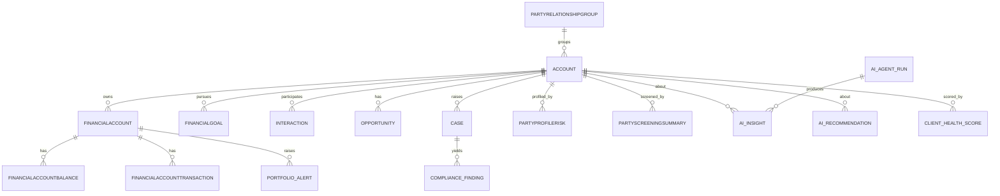
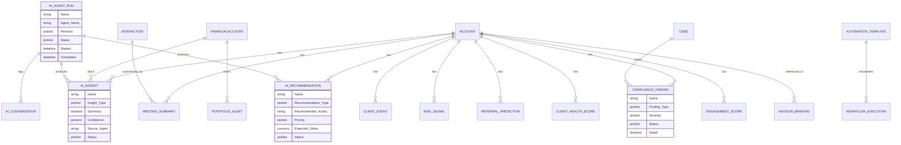

# Deliverable 5 — FSC Data Model

**Design principle: FSC-native first.** Every capability is mapped to a standard Financial Services Cloud object before any custom object is introduced. Custom objects are added only to persist AI artifacts (insights, recommendations, agent runs, scores, findings) that have no standard home.

This model is **grounded in the live target org** `wm-studio-org` (`360finance2.my.salesforce.com`, API 67.0), introspected via the Salesforce CLI. The org runs the **modern FSC data model** (standard `FinancialAccount`, `FinancialGoal`, `Interaction`, `InteractionSummary`, and the `Party*` family) rather than the legacy `FinServ__` managed package.

## Org introspection findings (standard objects confirmed present)

| Domain | FSC / standard objects confirmed in org |
|---|---|
| Parties & relationships | `Account` (record types: **Household**, Business, Person Account), `Contact`, `Individual`, `AccountContactRelation`, `PartyRelationshipGroup`, `PartyRoleRelation` |
| Financial accounts | `FinancialAccount`, `FinancialAccountParty`, `FinancialAccountBalance`, `FinancialAccountTransaction`, `FinancialAccountFee`, `FinancialAccountStatement` |
| Goals | `FinancialGoal`, `FinancialGoalParty`, `FinancialGoalFunding` |
| Assets & liabilities | `Asset`, `AssetRelationship`, `PartyFinancialAsset`, `PartyFinancialLiability` |
| Interactions | `Interaction`, `InteractionAttendee`, `InteractionParticipant`, `InteractionSummary`, `InteractionSummaryParticipant`, `EngagementInteraction`, `FinancialDealInteraction`, `FinclDealInteractionSummary` |
| Risk & profile | `PartyProfile`, `PartyProfileRisk`, `PartyIncome`, `PartyExpense` |
| Compliance (KYC/AML) | `PartyIdentityVerification` (+Step), `PartyScreeningStep`, `PartyScreeningSummary`, `PartyConsent` |
| Sales & service | `Lead`, `Opportunity`, `Campaign`, `Case`, `Task`, `Event` |
| Process | `ActionPlan`, `ActionPlanItem`, `ActionPlanTemplate` |

> Implication: KYC (`PartyIdentityVerification`), AML screening (`PartyScreening*`), consent (`PartyConsent`), risk profiling (`PartyProfileRisk`), and assets/liabilities (`PartyFinancialAsset/Liability`) are all **native** — the studio's compliance and portfolio capabilities extend these rather than re-implement them.

## Standard object usage map (capability → FSC object)

| Capability | Primary FSC object(s) | How used |
|---|---|---|
| Client 360 / Household | `Account` (Household RT), `PartyRelationshipGroup`, `AccountContactRelation` | Anchor of the unified client/household view |
| Goals-based planning | `FinancialGoal`, `FinancialGoalFunding`, `FinancialGoalParty` | Goals, funding progress, ownership |
| Portfolio / holdings | `FinancialAccount`, `FinancialAccountBalance`, `FinancialAccountTransaction`, `Asset` | Accounts, balances, transactions, positions |
| Risk profiling | `PartyProfileRisk`, `PartyProfile` | Risk tolerance, suitability inputs |
| Assets & liabilities | `PartyFinancialAsset`, `PartyFinancialLiability` | Held-away + net-worth picture |
| Interactions / meetings | `Interaction`, `InteractionSummary`, `InteractionAttendee` | Meeting capture + summaries |
| Leads & pipeline | `Lead`, `Opportunity`, `Campaign` | Distribution + conversion |
| Service | `Case` | Servicing + resolution |
| KYC | `PartyIdentityVerification`, `PartyIdentityVerificationStep` | Identity verification |
| AML | `PartyScreeningSummary`, `PartyScreeningStep` | Sanctions/PEP screening |
| Consent | `PartyConsent` | Consent + Responsible AI |
| Process orchestration | `ActionPlan`, `ActionPlanItem`, `ActionPlanTemplate` | Onboarding + workflow steps |
| Activities | `Task`, `Event` | Follow-ups, scheduling |

## Logical Data Model (conceptual)

## Custom AI objects (18)

These persist AI-generated artifacts and operational metadata. All are namespaced-friendly (no managed namespace in the dev build) and follow `*__c` conventions with auto-number names.

| # | Object (API name) | Name prefix | Purpose | Primary parent(s) |
|---|---|---|---|---|
| 1 | `AI_Insight__c` | AIN- | AI-generated insight about a client/portfolio | Account, FinancialAccount, AI_Agent_Run |
| 2 | `AI_Recommendation__c` | AIR- | Next-best-action / recommendation | Account, AI_Agent_Run |
| 3 | `AI_Agent_Run__c` | RUN- | Execution log of an agent invocation (audit) | User, (polymorphic related record) |
| 4 | `AI_Conversation__c` | CONV- | Turn-by-turn conversation transcript | AI_Agent_Run |
| 5 | `Meeting_Summary__c` | MTG- | Summary + action items from a meeting | Account, Interaction |
| 6 | `Advisor_Briefing__c` | BRF- | Daily prioritized advisor briefing | User (advisor), Account |
| 7 | `Portfolio_Alert__c` | PAL- | Portfolio drift/risk alert | FinancialAccount, Account |
| 8 | `Client_Event__c` | EVT- | Detected life/financial event | Account |
| 9 | `Risk_Signal__c` | RSK- | Risk/anomaly signal | Account, FinancialAccount |
| 10 | `Compliance_Finding__c` | CMP- | KYC/AML/suitability/surveillance finding | Account, Case |
| 11 | `Referral_Prediction__c` | REF- | Predicted referral propensity + value | Account |
| 12 | `Client_Health_Score__c` | CHS- | Composite client health score | Account |
| 13 | `Engagement_Score__c` | ENG- | Multi-channel engagement score | Account, Contact |
| 14 | `Automation_Template__c` | ATM- | Reusable automation definition | (standalone) |
| 15 | `Workflow_Execution__c` | WFX- | Run instance of an automation | Automation_Template |
| 16 | `Knowledge_Artifact__c` | KNA- | Grounding knowledge artifact | (standalone) |
| 17 | `Prompt_Library__c` | PRM- | Prompt template registry/governance | (standalone) |
| 18 | `Agent_Template__c` | AGT- | Agent definition registry/governance | (standalone) |

## Physical Data Model (ERD)

## Field definitions (key fields)

Standard fields (`Name`, `OwnerId`, `CreatedById`, audit fields) are omitted. Types shown are Salesforce field types.

### AI_Insight__c
| Field | Type | Notes |
|---|---|---|
| Insight_Type__c | Picklist | Portfolio / Relationship / Risk / Opportunity / Service |
| Summary__c | Long Text Area | The generated insight |
| Confidence__c | Percent | Model confidence 0-100 |
| Source_Agent__c | Text(120) | Originating agent |
| Status__c | Picklist | New / Reviewed / Actioned / Dismissed |
| Account__c | Lookup(Account) | Subject client/household |
| Financial_Account__c | Lookup(FinancialAccount) | Optional portfolio context |
| AI_Agent_Run__c | Lookup(AI_Agent_Run__c) | Provenance |

### AI_Recommendation__c
| Field | Type | Notes |
|---|---|---|
| Recommendation_Type__c | Picklist | Cross-Sell / Retention / Rebalance / Outreach / Compliance |
| Recommended_Action__c | Long Text Area | Action to take |
| Rationale__c | Long Text Area | Why (grounded) |
| Priority__c | Picklist | High / Medium / Low |
| Expected_Value__c | Currency | Estimated value |
| Status__c | Picklist | New / Accepted / Rejected / Completed |
| Account__c | Lookup(Account) | Target client |
| AI_Agent_Run__c | Lookup(AI_Agent_Run__c) | Provenance |

### AI_Agent_Run__c
| Field | Type | Notes |
|---|---|---|
| Agent_Name__c | Text(120) | Agent/topic invoked |
| Persona__c | Picklist | Advisor / Portfolio / Service / Distribution / Compliance / Operations / Executive |
| Status__c | Picklist | Running / Success / Failed / Escalated |
| Started__c | DateTime | Start |
| Completed__c | DateTime | End |
| Outcome__c | Long Text Area | Summary of outcome |
| Related_Record_Id__c | Text(18) | Subject record (polymorphic ref) |
| Run_User__c | Lookup(User) | Initiating/owning user |

### AI_Conversation__c
| Field | Type | Notes |
|---|---|---|
| AI_Agent_Run__c | Master-Detail(AI_Agent_Run__c) | Parent run |
| Role__c | Picklist | user / assistant / system / tool |
| Message__c | Long Text Area | Turn content |
| Sequence__c | Number(4,0) | Ordering |
| Channel__c | Picklist | Copilot / Mobile / API |

### Meeting_Summary__c
| Field | Type | Notes |
|---|---|---|
| Account__c | Lookup(Account) | Client |
| Interaction__c | Lookup(Interaction) | Source meeting |
| Summary__c | Long Text Area | Generated summary |
| Action_Items__c | Long Text Area | Extracted actions |
| Next_Steps__c | Long Text Area | Recommended next steps |
| Sentiment__c | Picklist | Positive / Neutral / Negative |

### Advisor_Briefing__c
| Field | Type | Notes |
|---|---|---|
| Advisor__c | Lookup(User) | Owning advisor |
| Briefing_Date__c | Date | For-date |
| Content__c | Long Text Area | Briefing body |
| Priorities__c | Long Text Area | Ranked priorities |
| Status__c | Picklist | Generated / Viewed / Dismissed |

### Portfolio_Alert__c
| Field | Type | Notes |
|---|---|---|
| Financial_Account__c | Lookup(FinancialAccount) | Affected account |
| Account__c | Lookup(Account) | Client/household |
| Alert_Type__c | Picklist | Drift / Concentration / Risk / Cash / Suitability |
| Severity__c | Picklist | Critical / High / Medium / Low |
| Detail__c | Long Text Area | Explanation |
| Status__c | Picklist | Open / Acknowledged / Resolved |

### Client_Event__c
| Field | Type | Notes |
|---|---|---|
| Account__c | Lookup(Account) | Client |
| Event_Type__c | Picklist | Liquidity / Job Change / Marriage / Inheritance / Retirement |
| Event_Date__c | Date | When |
| Detail__c | Long Text Area | Context |
| Source__c | Picklist | Detected / Advisor / External |

### Risk_Signal__c
| Field | Type | Notes |
|---|---|---|
| Account__c | Lookup(Account) | Client |
| Financial_Account__c | Lookup(FinancialAccount) | Optional |
| Signal_Type__c | Picklist | Market / Concentration / Liquidity / Behavioral / Cash |
| Severity__c | Picklist | Critical / High / Medium / Low |
| Detail__c | Long Text Area | Explanation |
| Detected__c | DateTime | Detection time |

### Compliance_Finding__c
| Field | Type | Notes |
|---|---|---|
| Account__c | Lookup(Account) | Subject |
| Case__c | Lookup(Case) | Linked case |
| Finding_Type__c | Picklist | KYC / AML / Suitability / Surveillance / Regulatory |
| Severity__c | Picklist | Critical / High / Medium / Low |
| Status__c | Picklist | Open / Under Review / Cleared / Escalated |
| Disposition__c | Long Text Area | Resolution + rationale |
| Detail__c | Long Text Area | Finding detail |

### Referral_Prediction__c, Client_Health_Score__c, Engagement_Score__c
| Object | Key fields |
|---|---|
| Referral_Prediction__c | Account__c (Lookup), Propensity__c (Percent), Predicted_Value__c (Currency), Recommended_Action__c (Long Text), Status__c (Picklist) |
| Client_Health_Score__c | Account__c (Lookup), Score__c (Number 5,2), Band__c (Picklist: Healthy/Watch/At-Risk), Drivers__c (Long Text), As_Of__c (Date) |
| Engagement_Score__c | Account__c (Lookup), Contact__c (Lookup), Score__c (Number 5,2), Trend__c (Picklist: Up/Flat/Down), Channel_Breakdown__c (Long Text), As_Of__c (Date) |

### Operational / governance objects
| Object | Key fields |
|---|---|
| Automation_Template__c | Category__c (Picklist), Description__c (Long Text), Flow_API_Name__c (Text), Active__c (Checkbox) |
| Workflow_Execution__c | Automation_Template__c (Lookup), Status__c (Picklist), Started__c (DateTime), Completed__c (DateTime), Related_Record_Id__c (Text 18), Result__c (Long Text) |
| Knowledge_Artifact__c | Artifact_Type__c (Picklist), Content__c (Long Text), Source__c (Text), Grounding_Enabled__c (Checkbox) |
| Prompt_Library__c | Prompt_Template_API_Name__c (Text), Persona__c (Picklist), Use_Case__c (Text), Version__c (Text), Status__c (Picklist: Draft/Approved/Retired) |
| Agent_Template__c | Agent_API_Name__c (Text), Persona__c (Picklist), Description__c (Long Text), Topics__c (Long Text), Status__c (Picklist: Draft/Approved/Retired) |

## Relationship summary

- **Account is the hub** for client-facing AI artifacts (insights, recommendations, scores, events, findings).
- **AI_Agent_Run__c is the provenance/audit hub** — insights, recommendations, and conversations link back to the run that produced them, satisfying model/prompt governance and audit ([D4 Governance Layer](04-enterprise-architecture.md)).
- **FinancialAccount** anchors portfolio artifacts (alerts, risk signals).
- **Case** links compliance findings into the standard service/compliance workflow.
- **Automation_Template__c → Workflow_Execution__c** captures the operations automation runtime.

## Deployable metadata

The physical model is realized as deployable source under
`WAM-Studio-SF-Build/force-app/main/default/objects/` (one folder per custom object, with `fields/` and the `Wealth_AI_Studio` permission set granting object + field access). See [D12 packaging](12-packaging-strategy.md).

### Deploy verification (target org `wm-studio-org`)

Deployed and verified live via `sf project deploy start` (API 67.0):

| Item | Result |
|---|---|
| 18 custom objects | Created |
| ~40 custom fields (lookups, picklists, text, number, currency, percent, datetime) | Created |
| `Wealth_AI_Studio` permission set (object + field FLS) | Created |
| Permission set assignment | Assigned to deploying user |
| Smoke test: create + query `AI_Agent_Run__c` (RUN-000000) | Passed (then cleaned up) |
| `EntityDefinition` presence check (8 key objects) | All present |

> Note: deployed custom fields do not auto-grant field-level security to existing profiles; the `Wealth_AI_Studio` permission set must be assigned (as done above) for users to read/write the fields.
