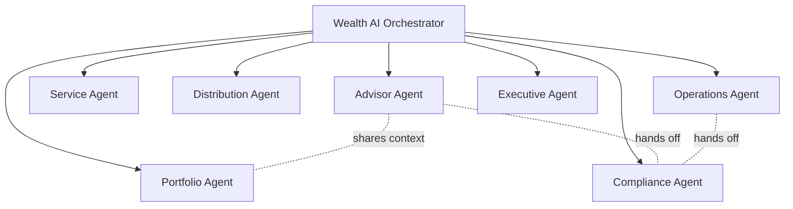
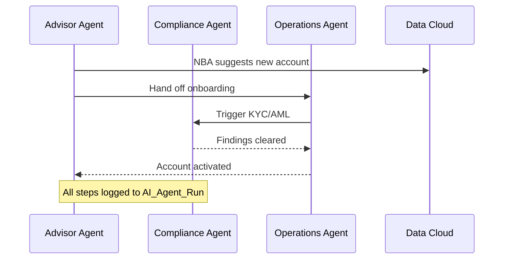

# Deliverable 6 — Agentforce Design

Seven role-aligned agents power the studio. Each is built in **Agentforce** (Agent Builder + Prompt Builder), grounded on **Data Cloud + FSC** ([D5](05-fsc-data-model.md)), and bounded by the **Einstein Trust Layer** and the Governance Layer ([D4](04-enterprise-architecture.md)). Every invocation is logged to `AI_Agent_Run__c` for audit.

*Diagrams: [agent topology](../diagrams/06-agent-topology.mmd), [agent interaction sequence](../diagrams/06-agent-sequence.mmd).*

## Agent portfolio

## Common design standards

| Concern | Standard |
|---|---|
| Grounding | Data Cloud unified profile, FSC records, Knowledge Artifacts (RAG) |
| Logging | Every run writes `AI_Agent_Run__c` (+ `AI_Conversation__c` turns) |
| Outputs | Persisted to `AI_Insight__c` / `AI_Recommendation__c` and surfaced in workspace |
| Trust | Einstein Trust Layer: masking, grounding, toxicity, zero-retention |
| Human-in-the-loop | Tier-3 autonomous actions require approval steps |
| Authoring | Agent Script bundles (`aiAuthoringBundles/`) + Prompt Builder templates |

## 1. Advisor Agent
Realizes UC 1-5, 7, 10, 24. Primary persona: Wealth Advisor.

| Attribute | Design |
|---|---|
| **Goals** | Grow relationships, increase wallet share, save advisor time via briefings, meeting prep, follow-ups, and next best actions |
| **Triggers** | Advisor opens workspace/client; "prep my meeting"; calendar event; post-meeting; daily schedule |
| **Inputs** | Account/Household, Financial Accounts, Goals, Interactions, Tasks, Opportunities, life events, calendar |
| **Actions** | Generate Daily Briefing; Generate Meeting Prep; Draft Follow-up; Recommend NBA; Draft Proposal; Summarize Client 360 |
| **Prompts** | `Meeting_Prep_Briefing`, `Client_360_Summary`, `Followup_Email`, `Next_Best_Action` (Prompt Builder) |
| **Grounding** | Data Cloud unified profile; FSC `Account/FinancialAccount/FinancialGoal/Interaction`; Knowledge Artifacts |
| **Guardrails** | No investment advice without suitability check; PII masking; cite sources; no fabricated holdings/figures |
| **Outputs** | `Advisor_Briefing__c`, `Meeting_Summary__c`, `AI_Recommendation__c`, draft Tasks/Emails; logged to `AI_Agent_Run__c` |

## 2. Portfolio Agent
Realizes UC 6-9, 27, 39. Primary persona: Portfolio Manager.

| Attribute | Design |
|---|---|
| **Goals** | Improve performance, detect risk/drift early, scale commentary, optimize allocations |
| **Triggers** | Portfolio review; threshold breach; market event; scheduled monitoring; "explain this portfolio" |
| **Inputs** | `FinancialAccount`, `FinancialAccountBalance/Transaction`, `Asset`, `PartyProfileRisk`, benchmarks, market data |
| **Actions** | Run Health Check; Detect Risk Exposure; Generate Commentary; Run Scenario; Raise Portfolio Alert |
| **Prompts** | `Portfolio_Commentary`, `Risk_Explanation`, `Review_Pack` |
| **Grounding** | Data Cloud portfolio/market streams; FSC financial-account family; `PartyProfileRisk` |
| **Guardrails** | Performance figures must come from data (no estimation); suitability-aware; compliance-aligned language |
| **Outputs** | `Portfolio_Alert__c`, `Risk_Signal__c`, `AI_Insight__c` (commentary); logged to `AI_Agent_Run__c` |

## 3. Service Agent
Realizes UC 28, 34. Primary persona: Client Service Associate / End Client.

| Attribute | Design |
|---|---|
| **Goals** | Faster resolutions, higher CSAT, lower handle time, deflection of routine requests |
| **Triggers** | New/updated `Case`; client portal/chat message; inbound email |
| **Inputs** | `Case`, client context, `Knowledge_Artifact__c`, prior cases, entitlements |
| **Actions** | Triage & Route Case; Draft Resolution; Answer from Knowledge; Escalate to human |
| **Prompts** | `Service_Resolution`, `Case_Summary`, `Knowledge_Answer` |
| **Grounding** | Knowledge base (RAG), `Case` history, FSC client context |
| **Guardrails** | No account changes without verification; escalate on low confidence/sensitive topics; cite knowledge |
| **Outputs** | Case updates, draft replies, `AI_Insight__c`; escalation; logged to `AI_Agent_Run__c` |

## 4. Distribution Agent
Realizes UC 13-15, 25, 37. Primary persona: Distribution Specialist.

| Attribute | Design |
|---|---|
| **Goals** | More qualified opportunities, higher conversion, better pipeline management |
| **Triggers** | New `Lead`; campaign response; "research this prospect"; scheduled prospecting |
| **Inputs** | `Lead`, `Campaign`, `Account/Contact`, enrichment + behavioral data, relationship graph |
| **Actions** | Score Lead; Prioritize Queue; Research Prospect; Predict Referral; Draft Outreach |
| **Prompts** | `Prospect_Research_Brief`, `Personalized_Outreach`, `Referral_Nudge` |
| **Grounding** | Data Cloud enrichment/behavioral; FSC `Lead/Account`; external research sources |
| **Guardrails** | Compliant outreach (opt-in/consent via `PartyConsent`); no unverified claims; respect Do-Not-Contact |
| **Outputs** | Lead scores, `AI_Recommendation__c`, `Referral_Prediction__c`, draft outreach; logged to `AI_Agent_Run__c` |

## 5. Compliance Agent
Realizes UC 16-18, 30, 36. Primary persona: Compliance Officer.

| Attribute | Design |
|---|---|
| **Goals** | Reduce risk, improve audit readiness, ensure regulatory compliance |
| **Triggers** | Onboarding KYC step; transaction/alert; communication review; regulatory update; scheduled surveillance |
| **Inputs** | `PartyIdentityVerification`, `PartyScreeningSummary/Step`, transactions, comms, policies, reg feeds |
| **Actions** | Run KYC Check; Triage AML Alert; Monitor Regulation; Surveil Comms/Trades; Create Finding |
| **Prompts** | `KYC_Checklist`, `AML_Rationale`, `Reg_Impact_Summary`, `Surveillance_Flag` |
| **Grounding** | FSC compliance objects, watchlists, regulatory knowledge base (RAG) |
| **Guardrails** | Human review for adverse findings; full audit trail; never auto-clear high-risk; explainable rationale |
| **Outputs** | `Compliance_Finding__c`, `Case` updates, audit evidence; logged to `AI_Agent_Run__c` |

## 6. Operations Agent
Realizes UC 19-21, 31, 32, 35. Primary persona: Operations Analyst.

| Attribute | Design |
|---|---|
| **Goals** | Process automation, exception reduction, operational efficiency, straight-through processing |
| **Triggers** | New onboarding; document upload; workflow request; reconciliation break; cash-movement event |
| **Inputs** | `ActionPlan/Item`, documents, `FinancialAccountTransaction`, custodian data, process definitions |
| **Actions** | Orchestrate Onboarding; Extract Document; Run Workflow; Reconcile; Flag Cash Anomaly |
| **Prompts** | `Document_Extraction`, `Onboarding_Status`, `Reconciliation_Explanation` |
| **Grounding** | FSC process objects, document insights, operational data |
| **Guardrails** | Deterministic Flows for state changes; approvals for money movement; exception escalation |
| **Outputs** | `Workflow_Execution__c`, populated records, `Risk_Signal__c`; logged to `AI_Agent_Run__c` |

## 7. Executive Agent
Realizes UC 22, 23, 38. Primary persona: Branch Manager.

| Attribute | Design |
|---|---|
| **Goals** | Team productivity, revenue/AUM growth, advisor effectiveness, data-driven coaching |
| **Triggers** | Manager opens dashboard; "how is my team doing?"; scheduled summary; KPI threshold |
| **Inputs** | Activities, pipeline, AUM/fees, productivity + AI-usage metrics, attrition risk |
| **Actions** | Summarize Productivity; Explain Revenue; Recommend Coaching; Alert on KPI |
| **Prompts** | `Productivity_Narrative`, `Revenue_Insight`, `Coaching_Recommendation` |
| **Grounding** | CRM Analytics datasets, `AI_Agent_Run__c` usage, FSC pipeline data |
| **Guardrails** | Aggregated/role-appropriate data only; no individual PII beyond entitlement; cite metrics |
| **Outputs** | Dashboard narratives, `AI_Recommendation__c` (coaching); logged to `AI_Agent_Run__c` |

## Cross-agent collaboration

## Authoring artifacts (in repo)

The Advisor Agent is authored as an **Agent Script** bundle and a **Prompt Builder** template under
`WAM-Studio-SF-Build/force-app/main/default/aiAuthoringBundles/Wealth_Advisor_Agent/` and `.../genAiPromptTemplates/`. The remaining six agents follow the identical structure (registered in the `Agent_Template__c` object for governance) and are summarized above.

> Deployment note: agent bundles require Agentforce to be enabled and a `default_agent_user` configured in the target org; they are provided as source templates and are deployed during agent enablement, separately from the data-model deploy verified in [D5](05-fsc-data-model.md).
