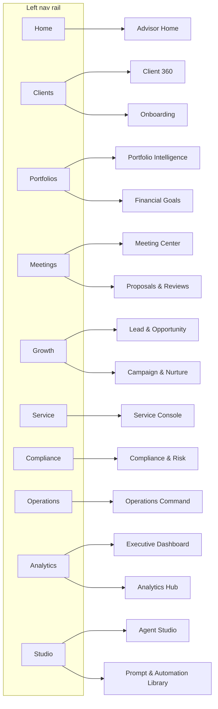

# Deliverable 7 — UX Design Specifications

The Salesforce Wealth AI Studio UX is delivered as a **Cosmos / SLDS-aligned** experience that runs inside Lightning Experience and the Salesforce mobile app, with Agentforce woven into every surface. This deliverable specifies the information architecture, the app shell, and all **24 screens** (16 desktop + 8 mobile) that realize the use cases ([D2](02-ai-use-case-catalog.md)) and agents ([D6](06-agentforce-design.md)).

Live Figma file: **[FS-Automation-Studio](https://www.figma.com/design/G6hyOQT78XLfwDrWpiaq6g/FS-Automation-Studio)** (design system + screens). See [D8](08-figma-design-package.md) for the design system and component library.

## 1. Design principles

| # | Principle | What it means here |
|---|---|---|
| 1 | AI in the flow of work | Agentforce assistant, NBAs, and AI insights are embedded in every workspace, not a separate destination |
| 2 | Grounded & transparent | Every AI output cites its source (FSC record, Data Cloud, Knowledge Artifact) and is logged to `AI_Agent_Run__c` |
| 3 | Trust by default | Suitability/compliance guardrails, human-in-the-loop approvals, and PII masking are visible in the UI |
| 4 | Advisor time is sacred | One-click prep, summaries, and follow-ups; the daily briefing is the home base |
| 5 | Native, not bolted-on | SLDS components, FSC record pages, and standard navigation; AI augments standard objects |
| 6 | Accessible & responsive | WCAG 2.1 AA, keyboard-first, light/dark, desktop-to-mobile parity for core tasks |

## 2. Personas → primary screens

| Persona ([D2](02-ai-use-case-catalog.md)) | Primary screens |
|---|---|
| Wealth Advisor | Advisor Home, Client 360, Meeting Center, Portfolio Intelligence, Proposals |
| Portfolio Manager | Portfolio Intelligence, Financial Goals, Analytics Hub |
| Relationship/Distribution | Lead & Opportunity, Campaign & Nurture, Client 360 |
| Onboarding Specialist | Client Onboarding, Service Console |
| Compliance Officer | Compliance & Risk, Operations Command |
| Service Associate | Service Console, Client 360 |
| Operations Manager | Operations Command, Analytics Hub |
| Executive / COO | Executive Dashboard, Analytics Hub |
| Admin / AI Engineer | Agent Studio, Prompt & Automation Library |

## 3. Information architecture & navigation

## 4. App shell anatomy (desktop)

| Region | Spec |
|---|---|
| Left nav rail | 64px wide, Navy 100 (`#032D60`); app logo + 8 destination icons; active item highlighted (Cloud Blue 30) |
| Top bar | 56px tall, white, bottom border `#E5E5E5`; page title (left), global search pill (center-right), **Ask Agentforce** button, user avatar |
| Content | Background `#F3F3F3`, 24px padding; page header (title + context + actions) → KPI strip → primary work area (typically 2-column: 2fr work, 1fr AI/insights) |
| AI assistant | Persistent right-column panel or invokable overlay; grounded chat with citations and quick actions; input pinned to bottom |
| States | Loading (skeletons), empty (guided CTA), error (inline + retry), AI-generating (progress indicator), needs-approval (badge + approve/reject) |

Grid: 12-column, 1440px reference, 24px gutters. Cards: white, 12px radius, 1px `#E5E5E5` border. Spacing scale 4/8/12/16/24/32.

## 5. Desktop screens (16)

Each screen lists: purpose, primary persona, key components, embedded AI/Agentforce, grounding objects ([D5](05-fsc-data-model.md)), and primary actions.

### D7-01 · Advisor Home — Daily Briefing  *(built live)*
- **Purpose:** Advisor's home base; prioritized start-of-day briefing, schedule, and actions.
- **Persona:** Wealth Advisor.
- **Components:** KPI strip (Book AUM, Clients at risk, Meetings today, Open NBAs); AI Daily Briefing list; Today's Meetings list; Agentforce Assistant panel; Top Next Best Actions.
- **AI/Agentforce:** Advisor Agent daily briefing; embedded grounded chat; NBA recommendations.
- **Grounding:** `Account/Household`, `FinancialAccount`, `FinancialGoal`, `Interaction`, Tasks, `AI_Recommendation__c`, `Advisor_Briefing__c`.
- **Actions:** Start my day, Prep meeting, Act on recommendation, Ask Agentforce.

### D7-02 · Client 360 — Household Overview
- **Purpose:** Unified household view: members, accounts, goals, engagement, risk/compliance.
- **Persona:** Wealth Advisor / Service Associate.
- **Components:** Household header (AUM, members, tenure, risk); KPI strip; Members & Accounts list; Recent Interactions timeline; Risk & Compliance card; client assistant.
- **AI/Agentforce:** Client 360 summary; "ask about this client"; relationship insights; `Client_Health_Score__c`.
- **Grounding:** `Account/Household`, `Contact`, `FinancialAccount`, `FinancialGoal`, `Interaction`, `PartyProfileRisk`, `PartyConsent`.
- **Actions:** Open record, Prep meeting, Log interaction, Create opportunity.

### D7-03 · Portfolio Intelligence — Holdings & Rebalancing
- **Purpose:** Portfolio health, allocation drift, rebalancing and tax-aware recommendations.
- **Persona:** Portfolio Manager / Advisor.
- **Components:** Value/drift/cash/tax KPIs; Allocation drift (target vs current); Rebalancing recommendations; Alerts (concentration, rate sensitivity); portfolio assistant.
- **AI/Agentforce:** Portfolio Agent health check, commentary, scenario; `Portfolio_Alert__c`, `Risk_Signal__c`.
- **Grounding:** `FinancialAccount`, `FinancialAccountBalance/Transaction`, `Asset`, `PartyProfileRisk`, benchmarks/market (Data Cloud).
- **Actions:** Generate proposal, Run scenario, Export, Create rebalance task.

### D7-04 · Meeting Center — Prep & Summaries
- **Purpose:** One place for meeting prep, live notes, and AI summaries/follow-ups.
- **Persona:** Wealth Advisor.
- **Components:** Meeting KPIs; Upcoming-needs-prep list; Recent summaries; Action items; meeting assistant.
- **AI/Agentforce:** Advisor Agent meeting prep + post-meeting summary + follow-up draft.
- **Grounding:** Events/calendar, `Account`, `Interaction`, `Meeting_Summary__c`, Tasks.
- **Actions:** Prep next, New meeting, Generate summary, Send follow-up.

### D7-05 · Lead & Opportunity — Pipeline & Propensity
- **Purpose:** Manage pipeline with AI propensity scoring and referral prediction.
- **Persona:** Relationship/Distribution.
- **Components:** Pipeline KPIs; Top opportunities by propensity; Referral predictions; Stalled deals; growth assistant.
- **AI/Agentforce:** Distribution Agent propensity, `Referral_Prediction__c`, `Engagement_Score__c`.
- **Grounding:** `Lead`, `Opportunity`, `Account`, `Interaction`, Data Cloud propensity models.
- **Actions:** New opportunity, Import, Draft outreach, Advance stage.

### D7-06 · Client Onboarding — Guided KYC/AML
- **Purpose:** Guided, AI-assisted onboarding with KYC/AML and document intake.
- **Persona:** Onboarding Specialist.
- **Components:** Onboarding progress stepper; Required documents checklist; KYC/AML status; identity verification; onboarding assistant.
- **AI/Agentforce:** Document summarization/extraction, completeness checks; routes exceptions to Compliance Agent.
- **Grounding:** `Account`, `PartyIdentityVerification`, `PartyScreening`, `PartyScreeningSummary`, `PartyConsent`, ContentDocument.
- **Actions:** Upload document, Run screening, Request info, Submit for approval.

### D7-07 · Compliance & Risk — Surveillance Console
- **Purpose:** Surveillance of communications, suitability, and AML with AI triage.
- **Persona:** Compliance Officer.
- **Components:** Risk KPIs; Findings queue (severity); Case detail; Audit trail; compliance assistant.
- **AI/Agentforce:** Compliance Agent triage/explanation; `Compliance_Finding__c`, `Risk_Signal__c`; human-in-the-loop approvals.
- **Grounding:** `Interaction`, `PartyProfileRisk`, `PartyScreening*`, `AI_Agent_Run__c` audit, Knowledge (policy).
- **Actions:** Triage, Escalate, Approve/Reject, Annotate, Export audit.

### D7-08 · Service Console — Cases & Inquiries
- **Purpose:** Omni-channel service with AI deflection, summaries, and reply drafts.
- **Persona:** Service Associate.
- **Components:** Case KPIs; Case queue; Conversation view; Knowledge & suggested replies; service assistant.
- **AI/Agentforce:** Service Agent summarize, suggest reply, knowledge RAG; `AI_Conversation__c`.
- **Grounding:** `Case`, `Account/Contact`, `Interaction`, `Knowledge_Artifact__c`, `FinancialAccount`.
- **Actions:** Reply, Resolve, Escalate, Create task, Insert knowledge.

### D7-09 · Financial Goals — Planning Workspace
- **Purpose:** Goal-based planning with funding-status tracking and AI scenarios.
- **Persona:** Portfolio Manager / Advisor.
- **Components:** Goal KPIs; Goals list (on/off track); Funding projection; Scenario panel; planning assistant.
- **AI/Agentforce:** Portfolio/Advisor agents scenario + contribution recommendations.
- **Grounding:** `FinancialGoal`, `FinancialAccount`, `FinancialPlan` (if present), `AI_Recommendation__c`.
- **Actions:** Add goal, Run scenario, Adjust contribution, Generate review.

### D7-10 · Proposals & Reviews — Generation Studio
- **Purpose:** Generate client-ready proposals and review packs from grounded data.
- **Persona:** Wealth Advisor.
- **Components:** Template gallery; Proposal builder; Live preview; Compliance check; proposal assistant.
- **AI/Agentforce:** Advisor/Portfolio agents draft narrative + charts; compliance language guardrails.
- **Grounding:** `Account`, `FinancialAccount`, `FinancialGoal`, `Knowledge_Artifact__c`, `Prompt_Library__c`.
- **Actions:** Generate, Edit, Run compliance check, Export/Send.

### D7-11 · Campaign & Nurture — Engagement
- **Purpose:** Segment-driven journeys and AI-personalized nurture.
- **Persona:** Relationship/Distribution / Marketing.
- **Components:** Engagement KPIs; Segments; Journey canvas summary; Content recommendations; engagement assistant.
- **AI/Agentforce:** Distribution Agent content + send-time personalization; `Engagement_Score__c`.
- **Grounding:** `Account/Contact`, `Interaction`, Data Cloud segments, `Knowledge_Artifact__c`.
- **Actions:** Create segment, Launch journey, Personalize, Measure.

### D7-12 · Operations Command — Workflow Monitor
- **Purpose:** Monitor automations, agent runs, and exceptions across the studio.
- **Persona:** Operations Manager / Admin.
- **Components:** Throughput/exception KPIs; Workflow executions list; Agent run monitor; Exception queue; ops assistant.
- **AI/Agentforce:** Operations Agent triage + remediation suggestions; `Workflow_Execution__c`, `AI_Agent_Run__c`.
- **Grounding:** `Workflow_Execution__c`, `AI_Agent_Run__c`, `Automation_Template__c`, Platform events.
- **Actions:** Retry, Reassign, Pause automation, Open run detail.

### D7-13 · Analytics Hub — Book Insights
- **Purpose:** Cross-book analytics: AUM, flows, retention, AI adoption/impact.
- **Persona:** Operations Manager / Portfolio Manager.
- **Components:** KPI strip; Trend charts; Cohort/retention; AI impact metrics; analytics assistant (NL query).
- **AI/Agentforce:** Executive/Analytics insights; natural-language analytics.
- **Grounding:** Data Cloud + CRM Analytics; `AI_Agent_Run__c`, `Client_Health_Score__c`.
- **Actions:** Filter, Drill down, Ask a question, Export.

### D7-14 · Executive Dashboard — Firm KPIs
- **Purpose:** Firm-level performance, growth, risk, and AI value at a glance.
- **Persona:** Executive / COO.
- **Components:** Headline KPIs (AUM, net new assets, NPS, at-risk AUM); growth & risk panels; AI value summary; executive assistant.
- **AI/Agentforce:** Executive Agent narrative summary + anomaly callouts.
- **Grounding:** Aggregated Data Cloud/CRMA, `AI_Insight__c`, `Risk_Signal__c`.
- **Actions:** Change period, Drill to segment, Ask for narrative, Share.

### D7-15 · Agent Studio — Agentforce Builder
- **Purpose:** Configure, test, and monitor the seven agents and their topics/actions.
- **Persona:** Admin / AI Engineer.
- **Components:** Agent list + status; Topic/action config; Test console; Run analytics; guardrail settings.
- **AI/Agentforce:** Meta-surface for `Agent_Template__c`, Agent Script bundles, planner config.
- **Grounding:** `Agent_Template__c`, `AI_Agent_Run__c`, `Prompt_Library__c`.
- **Actions:** Create agent, Edit topic/action, Test, Publish, Set guardrails.

### D7-16 · Prompt & Automation Library
- **Purpose:** Reusable prompt templates and automation blueprints catalog.
- **Persona:** Admin / AI Engineer / Advisor (consume).
- **Components:** Library grid; Prompt detail/version; Automation template detail; usage metrics; library assistant.
- **AI/Agentforce:** Manages `Prompt_Library__c`, `Automation_Template__c`; prompt testing.
- **Grounding:** `Prompt_Library__c`, `Automation_Template__c`, `Knowledge_Artifact__c`.
- **Actions:** New prompt/template, Version, Test, Deploy, Favorite.

## 6. Mobile screens (8)

Mobile uses a single-column layout, a 5-item bottom tab bar (Home, Clients, Meetings, Alerts, Assistant), 390x844 reference (iPhone), and the same Cosmos tokens. Core tasks reach parity with desktop; complex authoring (Agent Studio, Proposals) is view/approve-only on mobile.

| # | Screen | Purpose | Key components | AI/Agentforce |
|---|---|---|---|---|
| D7-M1 | Advisor Mobile Home | On-the-go briefing | Greeting, KPI tiles, priority actions, next meeting | Daily briefing, NBAs |
| D7-M2 | Client Snapshot | Quick client view before a call | Header, AUM, goals, last interaction, quick actions | Client 360 summary |
| D7-M3 | Portfolio Snapshot | Glanceable portfolio health | Value, drift gauge, alerts | Portfolio commentary |
| D7-M4 | Meeting Prep | Prep card en route | Agenda, talking points, action items | Meeting prep brief |
| D7-M5 | Alerts & Approvals | Triage + approve on mobile | Alert list by severity, approve/reject | Risk/compliance, HITL approvals |
| D7-M6 | Tasks & NBAs | Work the action list | Task list, NBA cards, complete/snooze | NBA recommendations |
| D7-M7 | Agentforce Chat | Conversational assistant | Full-screen grounded chat with citations + quick actions | All agents via orchestrator |
| D7-M8 | Notifications | Timely signals | Grouped notifications (meetings, alerts, approvals) | AI-prioritized |

## 7. Cross-cutting interaction patterns

| Pattern | Spec |
|---|---|
| Ask Agentforce | Available from top bar and every workspace; opens grounded chat scoped to current record; responses cite sources and offer quick actions |
| AI insight card | Title + grounded summary + source chips + actions (Accept, Edit, Dismiss); writes to `AI_Insight__c`/`AI_Recommendation__c` |
| Next Best Action | Ranked card with rationale, estimated value, and suitability flag; one-click to act or create task |
| Human-in-the-loop | Tier-3 actions render an Approve/Reject step with diff/preview; logged to `AI_Agent_Run__c` |
| Citations & trust | Source chips link to the originating FSC record/Knowledge Artifact; "How was this generated?" reveals grounding + model |
| Generating state | Inline progress indicator with cancel; never blocks the rest of the page |

## 8. Accessibility, responsiveness, theming

- **WCAG 2.1 AA:** color contrast >= 4.5:1 for text; focus-visible on all interactive elements; semantic headings; ARIA for live AI updates.
- **Keyboard-first:** all actions reachable without a mouse; Ask Agentforce has a global shortcut.
- **Responsive:** 2-column desktop collapses to stacked single-column < 1024px; mobile uses bottom tabs.
- **Theming:** light and dark token sets (see [D8](08-figma-design-package.md)); respects user/system preference.
- **States:** every screen specifies loading (skeleton), empty (guided CTA), error (inline + retry), and AI-generating states.

## 9. Live build status (Figma)

| Screen | Live in Figma | Notes |
|---|---|---|
| Design System Foundation | Yes | Tokens, color, type ramp |
| D7-01 Advisor Home — Daily Briefing | Yes | Full Cosmos app shell + AI panel |
| D7-02 … D7-16 (desktop) | Spec complete; live build queued | Blocked by Figma MCP Starter rate limit; resume when reset/upgraded |
| D7-M1 … D7-M8 (mobile) | Spec complete; live build queued | Same as above |

> The reusable Cosmos app-shell template (nav rail, top bar, KPI strip, cards, list rows, AI assistant panel) is validated live on D7-01 and is the basis for all remaining frames.

