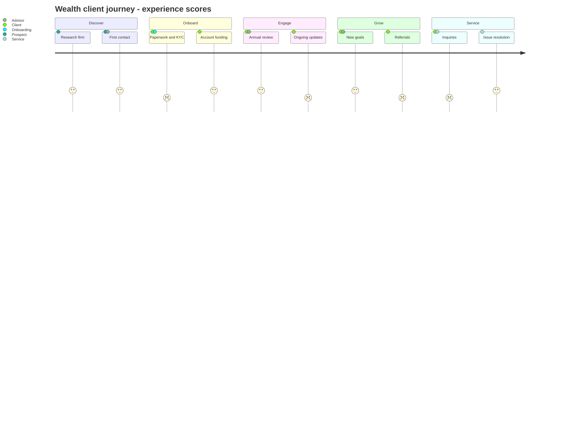
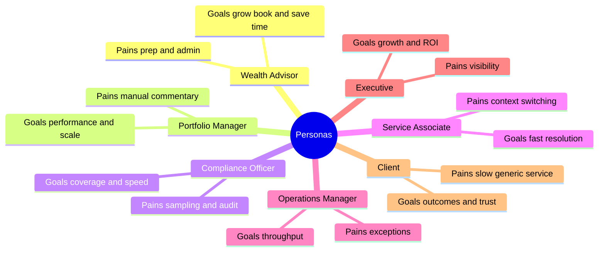
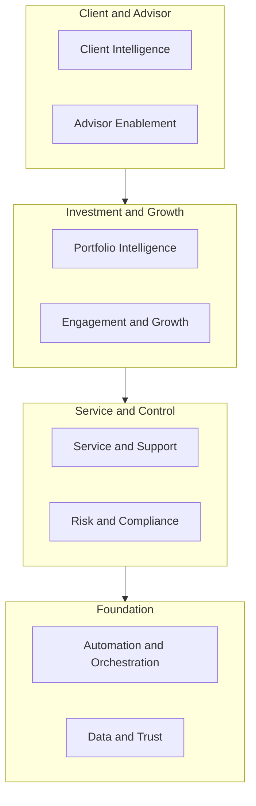
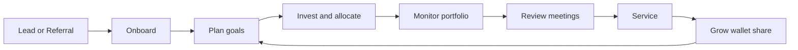
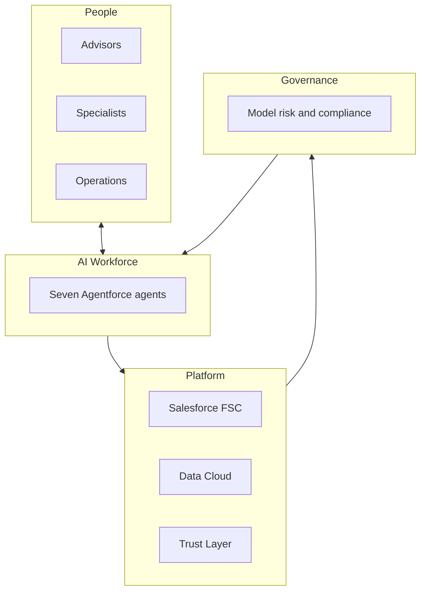
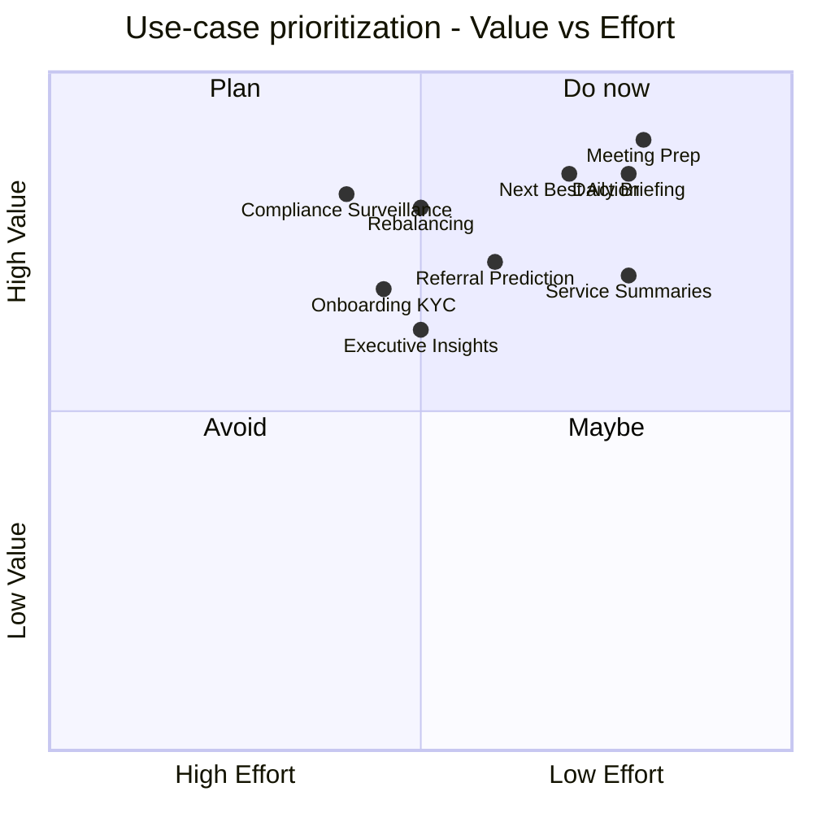
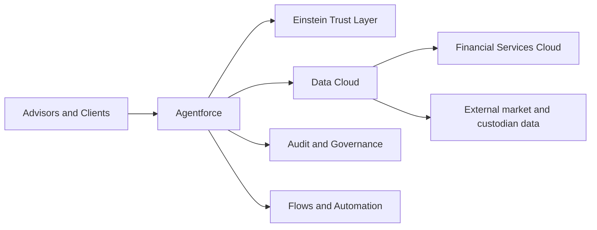
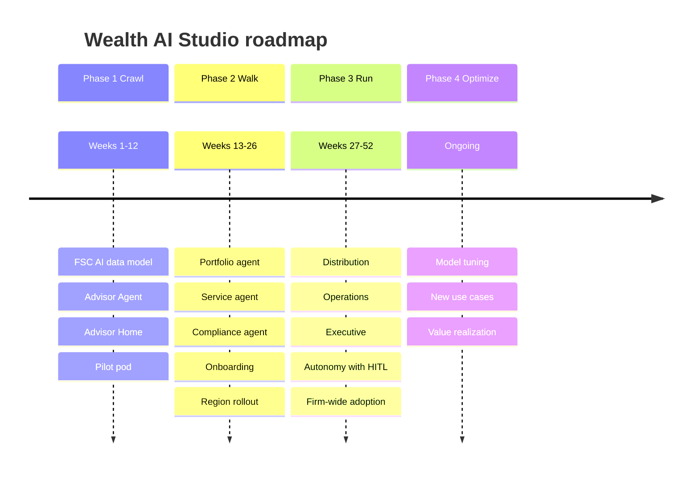

# Deliverable 9 — Workshop Package (FigJam / Miro)

A facilitator-ready discovery and alignment workshop, delivered as **importable Mermaid boards** ([diagrams/](../diagrams/)) plus this blueprint. Each board renders on GitHub and imports into FigJam, Miro, or draw.io (see [diagrams/README](../diagrams/README.md)). Use it to align stakeholders on pains, personas, capabilities, priorities, target architecture, and roadmap before/at the start of delivery ([D11](11-implementation-roadmap.md)).

## Suggested agenda (half-day)

| Time | Session | Board |
|---|---|---|
| 0:00 | Frame the day, outcomes | — |
| 0:15 | Challenges & pains | Challenge mindmap ([D1](01-industry-challenge-matrix.md)) |
| 0:45 | Personas & jobs-to-be-done | Persona map |
| 1:15 | Client journey (current vs target) | Client journey |
| 1:45 | Capability map | Capability map ([D3](03-capability-model.md)) |
| 2:15 | Prioritize use cases (value vs effort) | Prioritization quadrant ([D2](02-ai-use-case-catalog.md)) |
| 2:45 | Value stream & operating model | Value stream + Operating model |
| 3:15 | Architecture vision & trust | Architecture vision ([D4](04-enterprise-architecture.md)) |
| 3:45 | Roadmap & next steps | Roadmap timeline ([D11](11-implementation-roadmap.md)) |

## Boards

### 1. Client journey (`09-client-journey.mmd`)

### 2. Persona map (`09-persona-map.mmd`)

### 3. Capability map (`09-capability-map.mmd`)

### 4. Value stream (`09-value-stream.mmd`)

### 5. Operating model (`09-operating-model.mmd`)

### 6. Prioritization quadrant (`09-prioritization-quadrant.mmd`)

### 7. Architecture vision (`09-architecture-vision.mmd`)

### 8. Roadmap timeline (`09-roadmap-timeline.mmd`)

## Facilitation notes
- **Inputs:** pre-read [D0](00-executive-summary.md)-[D3](03-capability-model.md); bring real client examples (anonymized).
- **Method:** import each board into FigJam/Miro, then add sticky notes and dot-voting over the Mermaid base.
- **Outputs:** prioritized use-case shortlist, agreed personas/journey pains, target operating model, and a draft roadmap feeding [D11](11-implementation-roadmap.md).
- **Live boards:** can also be generated directly in FigJam via the Figma MCP once the tool-call limit resets.
