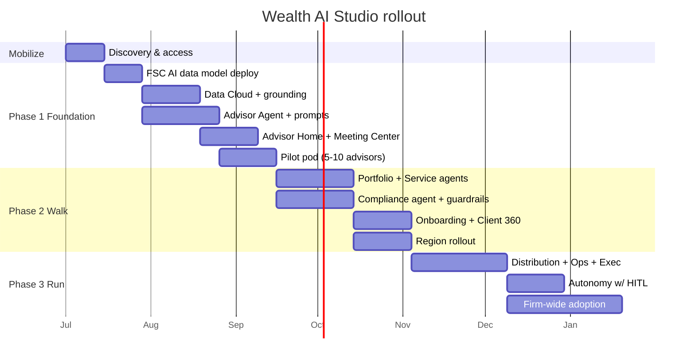

# Deliverable 11 — Implementation Roadmap

A crawl-walk-run path from a deployed accelerator to a firm-wide AI operating model. Phase 1 stands up the foundation and the Advisor Agent on a real org (already proven on `wm-studio-org`, [D5](05-fsc-data-model.md)); later phases scale agents, channels, and autonomy. The roadmap is sequenced to deliver advisor value in the first 90 days while building the trust and data foundation enterprise rollout requires.

*Diagrams: [roadmap gantt](../diagrams/11-roadmap-gantt.mmd), [roadmap timeline](../diagrams/09-roadmap-timeline.mmd).*

## Phasing model

| Phase | Theme | Duration | Outcome |
|---|---|---|---|
| 0 | Mobilize | 2 weeks | Aligned scope, access, success metrics, data assessment |
| 1 | Foundation + Advisor Agent (Crawl) | Weeks 1-12 | FSC AI data model live, Advisor Agent + briefings/meeting prep in production for a pilot pod |
| 2 | Portfolio + Service + Compliance (Walk) | Weeks 13-26 | 4-5 agents live, Data Cloud unification, compliance guardrails, broader rollout |
| 3 | Growth + Firm Scale (Run) | Weeks 27-52 | All 7 agents, distribution/ops/executive surfaces, autonomy with HITL, firm-wide adoption |
| 4 | Optimize & Extend | Ongoing | Model tuning, new use cases, value realization, continuous governance |

## Timeline

## Workstreams (parallel)

| Workstream | Phase 1 | Phase 2 | Phase 3 |
|---|---|---|---|
| Data & FSC | Deploy custom objects + permset; map FSC entities | Data Cloud unification; streams; identity resolution | Real-time signals; external data |
| Agentforce | Advisor Agent + 4 prompts | Portfolio/Service/Compliance agents | Distribution/Ops/Executive + orchestrator |
| Experience (UX) | Advisor Home, Meeting Center, Client 360 | Portfolio, Service, Onboarding, Compliance | Growth, Analytics, Executive, Studio |
| Trust & governance | Trust Layer config; audit via `AI_Agent_Run__c` | HITL approvals; compliance surveillance | Autonomy thresholds; model risk mgmt |
| Adoption & change | Pilot pod enablement | Train-the-trainer; playbooks | Firm-wide enablement; incentives |
| Value & measurement | Baseline metrics | Phase-2 value review | ROI realization ([D13](13-roi-value-framework.md)) |

## Phase 1 detail (first 90 days)

| Weeks | Milestone | Exit criteria |
|---|---|---|
| 1-2 | Org + access + data assessment | Sandbox/prod access, FSC confirmed, success metrics signed off |
| 3-4 | Deploy AI data model | 18 objects + permset deployed + smoke-tested (done on `wm-studio-org`) |
| 4-7 | Data Cloud + grounding | Unified profile + Knowledge Artifacts grounded; RAG validated |
| 4-8 | Advisor Agent + prompts | Briefing, meeting prep, NBA, follow-up live; logged to `AI_Agent_Run__c` |
| 6-9 | Advisor Home + Meeting Center + Client 360 | Screens live; advisors can prep in one click |
| 9-12 | Pilot pod | 5-10 advisors live; adoption + value baseline captured |

## Team & RACI

| Role | Mobilize | Build | Adopt |
|---|---|---|---|
| Executive sponsor (CWO/COO) | A | C | A |
| Product owner (Wealth) | R | A | R |
| Salesforce architect | C | R | C |
| Agentforce/AI engineer | C | R | C |
| FSC/Data Cloud engineer | C | R | C |
| Compliance/risk lead | C | C | C |
| Change/enablement lead | R | C | R |
| Pilot advisors | I | C | R |

(R responsible, A accountable, C consulted, I informed.)

## Prerequisites
- Salesforce org with **Financial Services Cloud** (confirmed modern FSC on `wm-studio-org`).
- **Agentforce** + **Data Cloud** + **Einstein Trust Layer** entitlements.
- Data access: client/household, accounts, goals, interactions; document sources for Knowledge.
- Identity/SSO, sandbox strategy, and a deployment pipeline.

## Risks & mitigations

| Risk | Impact | Mitigation |
|---|---|---|
| Data quality / fragmentation | AI ungrounded or wrong | Phase-1 data assessment; Data Cloud unification; cite-or-decline guardrail |
| Compliance/regulatory concern | Adoption blocked | Trust Layer + Compliance Agent + HITL from day one; full audit trail |
| Advisor adoption | Low ROI | Pilot pod, in-the-flow UX, time-saved metrics, champions |
| Scope creep | Slips timeline | Tiered use cases ([D2](02-ai-use-case-catalog.md)); ship Advisor Agent first |
| Model performance/cost | Latency/spend | Right-size models per prompt; cache; monitor via Operations Command |

## Success criteria by phase
- **Phase 1:** advisor prep time down materially; >70% pilot weekly active; briefing/meeting-prep in production.
- **Phase 2:** 4-5 agents live; compliance surveillance operational; positive value review.
- **Phase 3:** all 7 agents; firm-wide adoption; measurable AUM/NNA and efficiency impact ([D13](13-roi-value-framework.md)).
