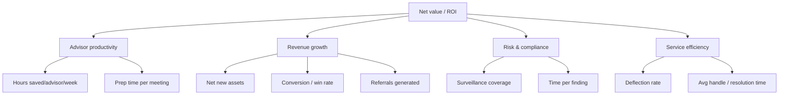

# Deliverable 13 — ROI & Value Framework

A structured way to quantify, instrument, and realize the value of the Wealth AI Studio. It connects the use cases ([D2](02-ai-use-case-catalog.md)) and agents ([D6](06-agentforce-design.md)) to four value drivers, defines how each is measured natively in Salesforce, and provides an illustrative business case. **All figures below are illustrative defaults for modeling; replace with firm-specific baselines during Phase 0 ([D11](11-implementation-roadmap.md)).**

*Diagram: [ROI KPI tree](../diagrams/13-roi-kpi-tree.mmd).*

## Value drivers

| Driver | How AI creates value | Primary agents |
|---|---|---|
| 1. Advisor productivity | Automate prep, summaries, research, follow-ups, admin | Advisor, Portfolio |
| 2. Revenue growth (AUM/NNA) | More client time, better NBAs, referrals, conversion | Advisor, Distribution, Portfolio |
| 3. Risk & compliance efficiency | Automated surveillance, suitability, audit | Compliance, Operations |
| 4. Service & cost-to-serve | Deflection, summaries, faster resolution | Service, Operations |

## KPI tree

## Metrics & instrumentation

| Metric | Baseline (illus.) | Target | Measured via |
|---|---|---|---|
| Advisor hours saved / week | 0 | 6-10 hrs | Activity + `AI_Agent_Run__c` usage; time-and-motion |
| Meeting prep time | 45 min | < 5 min | Meeting Center + `Meeting_Summary__c` |
| Client-facing time | 40% | 55-60% | Calendar/activity analysis |
| Net new assets / advisor / yr | baseline | +10-20% | Opportunity/Account flows |
| Win rate (new business) | 28% | 33-38% | `Opportunity` + propensity |
| Referrals / advisor / qtr | baseline | +25% | `Referral_Prediction__c` outcomes |
| Surveillance coverage | sample-based | ~100% | Compliance console + `Compliance_Finding__c` |
| Time per compliance finding | baseline | -40% | `AI_Agent_Run__c` + case data |
| Case deflection | baseline | +15-25% | Service console + `AI_Conversation__c` |
| AI adoption (WAU) | 0 | > 70% | `AI_Agent_Run__c` distinct users |

> Native instrumentation: because every agent run is logged to `AI_Agent_Run__c` (with conversations, insights, and recommendations), AI usage and impact are measurable inside Salesforce, no separate analytics stack required.

## Value methodology

For each driver: **Value = (impact per unit) x (volume) x (adoption) x (attribution)**, summed and compared to total cost of ownership.

- **Adoption factor:** ramps by phase (e.g., 30% → 60% → 80%).
- **Attribution:** conservative discount on revenue uplift to isolate AI's contribution (e.g., 50%).
- **Confidence tiers:** productivity (high), service (high), compliance (medium), revenue (medium), matching use-case tiers in [D2](02-ai-use-case-catalog.md).

## Illustrative business case (200 advisors)

**Assumptions (illustrative):** 200 advisors; fully-loaded advisor cost $180k/yr (~$90/hr); 7 hrs saved/advisor/week at 70% adoption; revenue per $1 AUM and fees per firm; platform + implementation cost modeled below.

| Value driver | Calculation (illustrative) | Annual value |
|---|---|---|
| Productivity | 200 x 7 hrs x 46 wks x $90 x 70% adoption | ~$4.05M |
| Revenue growth (NNA/fees) | Conservative fee uplift on incremental NNA, 50% attribution | ~$3.5M |
| Compliance efficiency | Surveillance automation + finding time reduction | ~$0.8M |
| Service efficiency | Deflection + faster resolution | ~$0.6M |
| **Gross annual value** | | **~$8.95M** |

| Cost (illustrative) | Annual |
|---|---|
| Platform (Agentforce/Data Cloud/Trust Layer + consumption) | ~$1.8M |
| Implementation (amortized yr 1) | ~$1.2M |
| Run/enablement | ~$0.5M |
| **Total cost (yr 1)** | **~$3.5M** |

- **Net value (yr 1, illustrative):** ~$5.45M
- **ROI (yr 1):** ~155%
- **Payback:** ~5-6 months
- Steady-state ROI improves as implementation cost amortizes and adoption rises.

## Value by persona

| Persona | Primary value | Headline metric |
|---|---|---|
| Advisor | Time back + more relationships | Hours saved, prep time |
| Portfolio manager | Scaled, explained insight | Reviews/commentary per FTE |
| Distribution | More NNA + referrals | Win rate, referrals |
| Compliance | Coverage + speed | Surveillance coverage, finding time |
| Service | Lower cost-to-serve | Deflection, resolution time |
| Executive | Firm growth + measurable AI ROI | NNA, at-risk AUM, AI value |

## Realization plan
1. **Phase 0:** capture firm baselines for every metric above.
2. **Phase 1:** measure productivity + adoption on the pilot pod ([D11](11-implementation-roadmap.md)).
3. **Phase 2-3:** add revenue, compliance, and service metrics as agents go live.
4. **Quarterly value review:** report actuals vs targets via the Executive Dashboard ([D7-14](07-ux-design-specs.md)); recalibrate assumptions.

## Sensitivity (what moves ROI most)
- **Adoption** is the biggest lever, in-the-flow UX and enablement protect it ([D7](07-ux-design-specs.md), [D11](11-implementation-roadmap.md)).
- **Attribution discipline** keeps the revenue case credible.
- **Consumption cost** controlled by right-sizing models per prompt and monitoring via Operations Command ([D7-12](07-ux-design-specs.md)).
